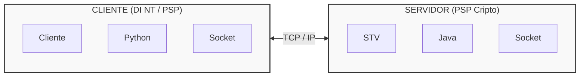
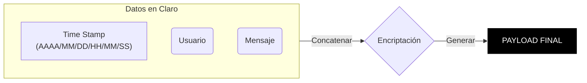

# BRIEFFING: PROYECTO CHAT
---

## Esquema de Arquitectura

---

## REQUISITOS

### Funcionales (Capacidad)

**VERSION 1 (MVP)**
- Enviar msj
- Recibir msj
- Registro horario msj
- Usuarios
- Encriptados

**VERSION 2**
- Grupos
- Stickers
- Responder msj

**VERSION 3**
- Documentos (fotos)
- Visto msj
- Filtro busqueda
- Estado usuario (conectado, desconectado, ausente)
- Reenvio msj

**VERSION 4**
- Biblioteca docs

### No Funcionales (Tecnologías)

* **Servidor:** Java (Multihilo)
* **Cliente:** Python / QTDesigner + PySide6
* **Protocolo y Seguridad (Payload):**

---

## TAREAS

- [ ] Investigar cripto
- [ ] Investigar sockets python
- [ ] Mockup Interfaz
- [ ] Diagrama de clases (Cliente, Servidor)
- [ ] Interfaz QTDesigner
- [ ] Servidor Multihilo
- [ ] Cliente Python con sockets
- [ ] Interfaz: Señales + Slots
- [ ] Pruebas
- [ ] Documentación
